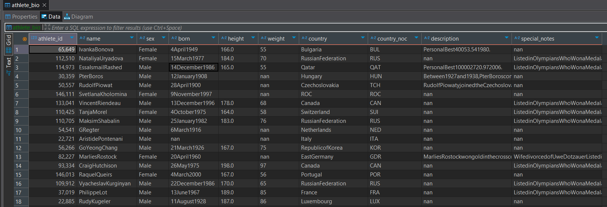
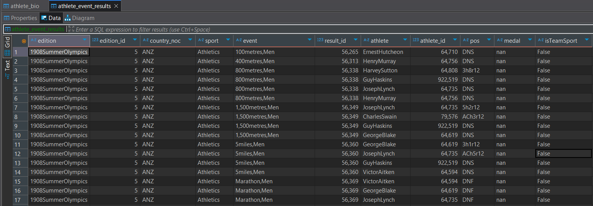
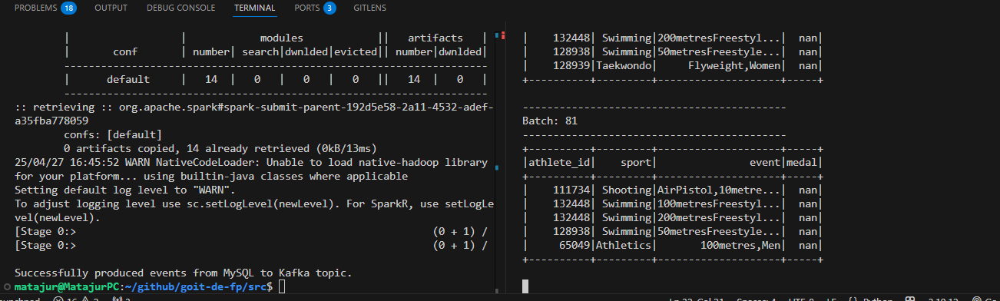
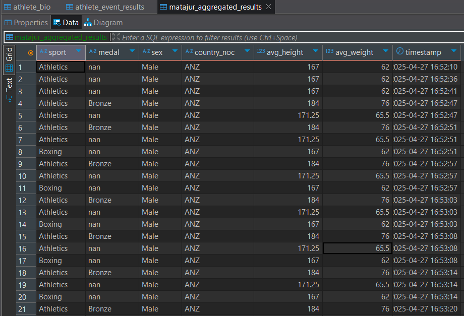

# Tier 2. Module 6 - Data Engineering

## Final assignment

### Technical Task

### Part 1. Building an End-to-End Streaming Pipeline

You work in a bookmaker. One of your tasks is to generate data for ML models. Some of the features are the average height, average weight, gender, and country of origin of athletes.

The models are trained separately for each sport. The data on the presence of a medal in a performance is used as a target (output) for the ML model.

The company wants to adjust the odds of betting as quickly as possible, so you have been asked to develop an appropriate solution using streaming. The athletes' physical data is known in advance and stored in a MySQL database. The results of the competitions are submitted via a Kafka topic.

**The task:**

1. Read the data of the athletes' physical indicators using Spark from the MySQL `table olympic_dataset.athlete_bio` (the database and Credentials for it will be provided to you).

2. Filter the data where the height and weight indicators are empty or are not numbers. You can do this at any stage of your program.

3. Read data from the mysql table `athlete_event_results` and write to the Kafka topic `athlete_event_results`. Read data with competition results from the Kafka topic `athlete_event_results`. Data from json format must be converted to dataframe format, where each json field is a separate column.

4. Combine data with competition results from the Kafka topic with biological data from the MySQL table using the `athlete_id` key.

5. Find the average height and weight of athletes individually for each sport, type of medal or lack thereof, gender, country (`country_noc`). Also add a timestamp when the calculations were made.

6. Make a data stream (using the `forEachBatch` function) to:

a. the original Kafka topic,

b. the database.

### Part 2. Building an End-to-End Batch Data Lake

In this part of the project, you will create a simple multi-hop datalake that will use data processing tools such as Spark to work with data and organize ETL processes (Extract, Transform, Load).

The task will be similar to the one you solved in the first final project, but this time you will work with batches of data, which is critical for any Data Engineering system.

During the task, you will work with data about athletes and their sports results that you already know. These are the `athlete_bio` and `athlete_event_results` tables, which are located on the FTP server at `https://ftp.goit.study/neoversity/athlete_bio.csv` and `https://ftp.goit.study/neoversity/athlete_event_results.csv`, respectively.

The main task is to build a three-level data processing architecture: from the initial storage (landing zone), through the processed and cleaned data (bronze/silver), to the final analytical set (gold).

**The task:**

1. Write the file `landing_to_bronze.py`. It should:

- download the file from the ftp server in the original csv format,
- using Spark, read the csv file and save it in parquet format to the `bronze/{table}` folder, where `{table}` is the table name.

2. Write the file `bronze_to_silver.py`. It should:

- read the bronze table,
- perform the text cleaning function for all text columns,
- perform row deduplication,
- write the table to the `silver/{table}` folder, where `{table}` is the table name.

3. Write the file `silver_to_gold.py`. It should:

- read two tables: `silver/athlete_bio` and `silver/athlete_event_results`,
- join on the `athlete_id` column,
- find the average weight and height for each combination of these 4 columns — `sport`, `medal`, `sex`, `country_noc`,
- add a `timestamp` column with the timestamp of the program execution,
- write the data to `gold/avg_stats`.

4. Write the `project_solution.py` file, which will contain the Airflow DAG, which will sequentially run all three files.
