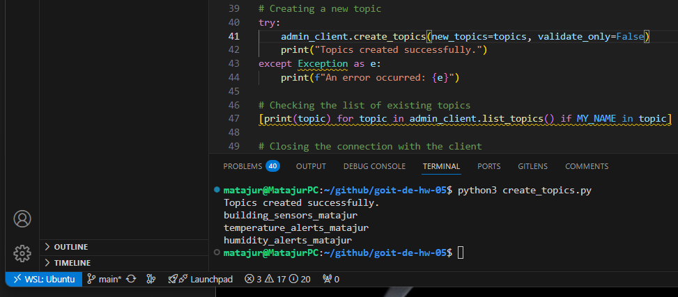

# Tier 2. Module 6 - Data Engineering. Homework

## Lesson 05. Apache Kafka

Today, you will focus on practical use of Apache Kafka using the Python API, practicing the skills of creating topics, writing data to a topic, and reading it.

Imagine that you work for a company that develops monitoring systems for the Internet of Things (IoT). The main task of the system is to collect data from various sensors installed in several different buildings and analyze this data in real time to track indicators such as temperature and humidity.

To do this, Apache Kafka is used as a messaging platform that allows you to efficiently transfer and process large amounts of data. The task is to **implement several components of this system using Python and Apache Kafka**, according to the instructions.

### Technical Task

#### 1. Creating topics in Kafka

Create three topics in Kafka:
```
Add your names or other identifiers to the topic names so that the topic names are not duplicated.
```
* `building_sensors` — to store data from all sensors,
* `temperature_alerts` — to store notifications about exceeding the permissible temperature level,
* `humidity_alerts` — to store notifications about the humidity level exceeding the permissible limits.



#### 2. Sending data to topics

* Write a Python script that simulates the operation of the sensor and periodically sends randomly generated data (temperature and humidity) to the `building_sensors` topic.
* The data should contain the sensor ID, the time of data acquisition, and the corresponding indicators.
* One run of the script should correspond to only one sensor. That is, in order to simulate multiple sensors, you need to run the script several times.
```
The sensor ID can simply be a random number, but constant (the same) for one run of the script. When re-running the sensor ID may change.
```
* Temperature is a random value from 25 to 45.
* Humidity is a random value from 15 to 85.


#### 3. Data processing

* Write a Python script that subscribes to the `building_sensors` topic, reads the messages and checks the received data:
  - if the temperature exceeds 40°C, generates a notification and sends it to the `temperature_alerts` topic;
  - if the humidity exceeds 80% or reaches less than 20%, generates a notification and sends it to the `humidity_alerts` topic.

* Notifications should contain the sensor ID, the value of the indicators, the time and a message about exceeding the threshold value.


#### 4. Final data

Write a Python script that subscribes to the `temperature_alerts` and `humidity_alerts` topics, reads the notification and displays the message.


