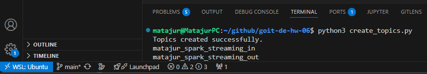
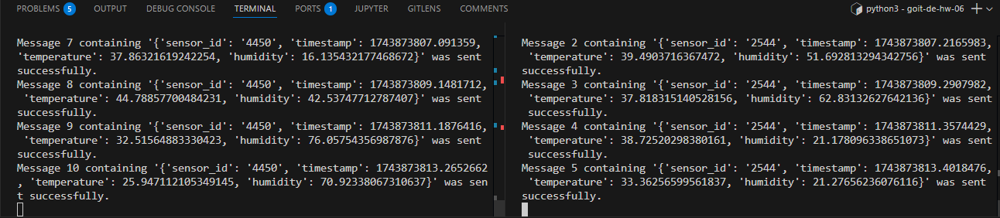
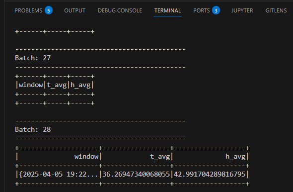
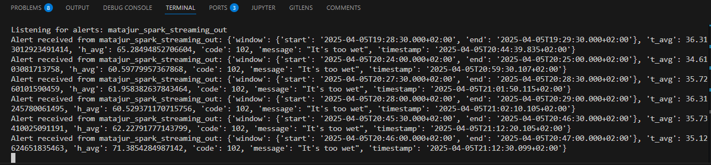

# Tier 2. Module 6 - Data Engineering. Homework
## Lesson 06. Spark streaming

Today you will perform a typical task for monitoring data values ​​of IoT devices.

In this homework assignment, you need to create a program for a data stream from a Kafka topic generated by sensors that will analyze the data and write alerts to an alert-Kafka topic when certain conditions are met.

### Technical Task

#### 1. Data stream generation

The input data is data from a Kafka topic, the same as in the previous homework. Generate a data stream containing `id`, `temperature` , `humidity`, `timestamp`. You can use the script and topic you wrote earlier.





#### 2. Data aggregation

Read the data stream you generated in step 1. Using a *Sliding window* of 1 minute, *sliding_interval* of 30 seconds, and *watermark duration* of 10 seconds, find the average temperature and humidity.



#### 3. Getting to know alert settings

Your boss likes to change the alert criteria. So, to deploy the code every time, the alert parameters are specified in a file:

[alerts_conditions.csv](https://drive.google.com/file/d/1TBrcwoEsPR_7WyPZY7rIyQelB-8NZa3F/view?usp=sharing)

The file contains the maximum and minimum values ​​for temperature and humidity, the message, and the alert code. The values ​`​-999,-999` indicate that they are not used for this alert.

Look at the data in the file. It should be intuitive. You should read the data from the file and use it to configure the alerts.

#### 4. Building alert definitions

Once you have found the average values, you need to determine whether they meet the criteria in the file (hint: perform a cross join and filter).

#### 5. Writing data to a Kafka topic

Write the received alerts to the original Kafka topic.

Example of a message in Kafka resulting from this code:

```Python
{
    "window": {
        "start": "2024-08-18T16:08:00.00.000+03:00",
        "end": "2024-08-18T16:09:00.00.000+03:00"
    },
    "t_avg": 56.61538461538461,
    "h_avg": 58.07692307692308,
    "code": "104",
    "message": "It's too hot",
    "timestamp": "2024-08-18 16:05:50.907777"
}
```



### Acceptance criteria

1. Generation of sensor data.
2. Finding the average values ​​of indicators.
3. Building a filtering mechanism that will determine which records are alerts.
4. Writing data to a Kafka topic.
