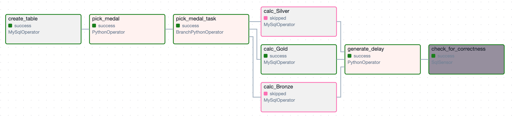
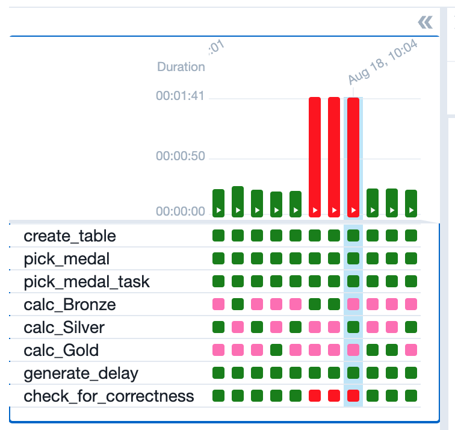
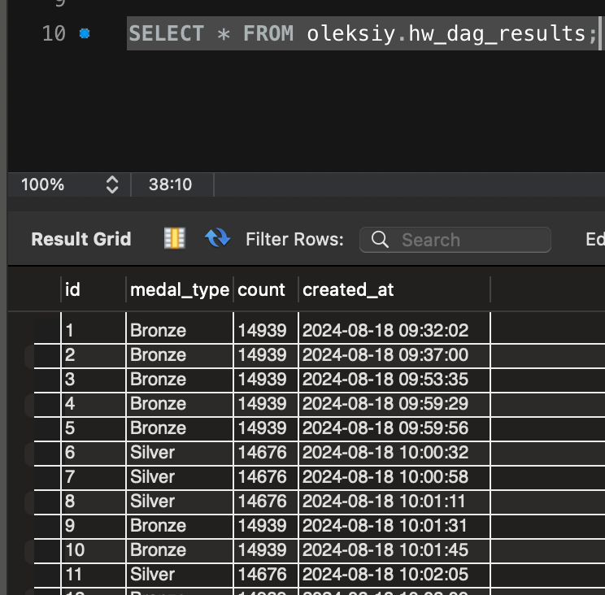

# Tier 2. Module 6 - Data Engineering. Homework

## Lesson 07. Apache Airflow

Your task today is to implement a DAG using the operators you learned to perform a specific set of application tasks.

This task will help you consolidate your knowledge of Apache Airflow for working with MySQL databases, master the logic of DAG branching, depending on the results of previous tasks, and consolidate your ability to work with task execution delays in DAG.

It will also help you better understand how to manage data processing processes in Apache Airflow, and prepare you to solve more complex data work scenarios.

### Technical Task

Write a DAG that has the following tasks (each item → one task):



1. Create a table

```
Use IF NOT EXISTS with the fields
id (auto-increment, primary key),
medal_type,
count,
created_at.
```

2. Randomly chooses one of three values ​​['`Bronze`', '`Silver`', '`Gold`'].

3. Depending on the selected value, it launches one of three tasks (branches).

4. Description of the three tasks:

1) The task counts the number of records in the olympic_dataset.athlete_event_results table that contain the entry Bronze in the medal field, and writes the resulting value to the table created in step 1, along with the medal type and the time the record was created.

2) The task counts the number of records in the olympic_dataset.athlete_event_results table that contain the entry Silver in the medal field, and writes the resulting value to the table created in step 1, along with the medal type and the time the record was created.

3) The task counts the number of records in the olympic_dataset.athlete_event_results table that contain the entry Gold in the medal field, and writes the resulting value to the table created in step 1, along with the medal type and the time the record was created.

5. Starts delaying the execution of the next task.
Use PythonOperaor with the time.sleep(n) function if one of the three previous tasks has completed successfully.

6. Checks with the sensor whether the newest entry in the table created in step 1 is not older than 30 seconds (compared to the current time). The idea is to make sure that the table has actually been written to.



With the delay task in step 5, you can create a delay of 35 seconds to make sure that the sensor is indeed "dropping" if the delay is greater than 30 seconds.


