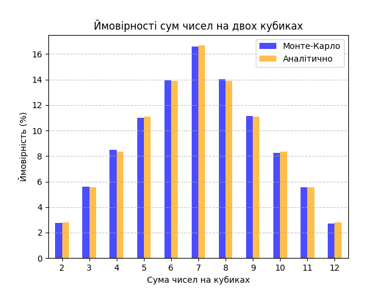

# Завдання 7. Використання методу Монте-Карло для симуляції кидків 2-х кубиків

```
 Сума Монте-Карло    Аналітично
    2       2.79%  2.78% (1/36)
    3       5.64%  5.56% (1/18)
    4       8.31%  8.33% (1/12)
    5      11.12%  11.11% (1/9)
    6      13.96% 13.89% (5/36)
    7      16.65%  16.67% (1/6)
    8      13.85% 13.89% (5/36)
    9      11.12%  11.11% (1/9)
   10       8.24%  8.33% (1/12)
   11       5.48%  5.56% (1/18)
   12       2.84%  2.78% (1/36)
```



Графік відображає, наскільки симуляції Монте-Карло відповідають аналітичним ймовірностям зі зростанням кількості випробувань, демонструючи надійність симуляцій Монте-Карло для ймовірнісного аналізу. 
Також, треба зазначити ефективність методу Монте-Карло у наближенні ймовірностей випадкових подій, особливо 
коли аналітичні розв'язки є складними, хоча в даному випадку це не є важливим, через простоту проблеми.

Якість методу Монте-Карло значно залежить від квлькості спостережень, чим більше - тим точніше результат. 
На експеременті ми бачимо, що 100 000 спостережень вже дають достатньо високу якість результату.
