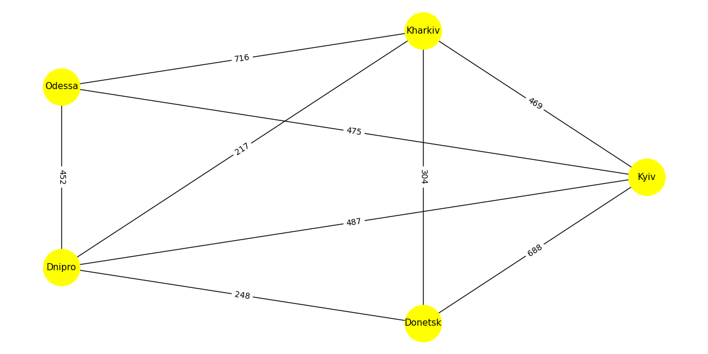

## Завдання 1
Створіть граф за допомогою бібліотеки networkX для моделювання певної реальної мережі (наприклад, транспортної мережі міста, соціальної мережі, інтернет-топології).  

- **Number of nodes**: 5, number of edges: 9
- **Degree Centrality**: 'Kyiv': 1.0, 'Kharkiv': 1.0, 'Odessa': 0.75, 'Dnipro': 1.0, 'Donetsk': 0.75
- **Closeness Centrality**: 'Kyiv': 1.0, 'Kharkiv': 1.0, 'Odessa': 0.8, 'Dnipro': 1.0, 'Donetsk': 0.8
- **Betweenness Centrality**: 'Kyiv': 0.06, 'Kharkiv': 0.06, 'Odessa': 0.0, 'Dnipro': 0.06, 'Donetsk': 0.0

## Завдання 2
Напишіть програму, яка використовує алгоритми DFS і BFS для знаходження шляхів у графі, який було розроблено у першому завданні.

### Результати виконання алгоритмів:

Breadth-first search (BFS):  
Kyiv -> Odessa -> Kharkiv -> Dnipro -> Donetsk 

Depth-first search (DFS):  
Kyiv -> Kharkiv -> Odessa -> Dnipro -> Donetsk

### Aлгоритм BFS (Breadth-first search):
За результатами виконання алгоритму BFS ми бачимо, що він працює очікувано та коректно. Тобто спочатку алгоритм бере вершини які з'єднані з нашою "початковою" вершиною (Київ) ребрами - "найближчі" вершини, а потім алгоритм переходить до вершин пов'язаних ребрами вже з "найближчими" вершинами, і так далі поки не пройде всі вершини.

### Aлгоритм DFS (Depth-first search):
За результатами виконання алгоритму DFS ми бачимо, що він працює очікувано та коректно. Тобто спочатку алгоритм йде по вершинам до самої глибини, поки є зв'язок ребрами між вершинами, коли таких вершин більше нема, алгоритм починає з початку шукати які вершини він ще не пройшов.

## Завдання 3
Реалізуйте алгоритм Дейкстри для знаходження найкоротшого шляху в розробленому графі: додайте у граф ваги до ребер та знайдіть найкоротший шлях між всіма вершинами графа.

### Shortest path from vertex Kyiv to other vertices of the graph

| Vertex  | Distance |
|---------|----------|
| Kharkiv | 469      |
| Odesa   | 475      |
| Donetsk | 688      |
| Dnipro  | 487      |

### Shortest path from vertex Kharkiv to other vertices of the graph

| Vertex  | Distance |
|---------|----------|
| Kyiv    | 469      |
| Odesa   | 676      |
| Donetsk | 304      |
| Dnipro  | 224      |

### Shortest path from vertex Odesa to other vertices of the graph

| Vertex  | Distance |
|---------|----------|
| Kyiv    | 475      |
| Kharkiv | 669      |
| Donetsk | 700      |
| Dnipro  | 452      |

### Shortest path from vertex Donetsk to other vertices of the graph

| Vertex  | Distance |
|---------|----------|
| Kyiv    | 688      |
| Kharkiv | 304      |
| Odesa   | 700      |
| Dnipro  | 248      |

### Shortest path from vertex Dnipro to other vertices of the graph

| Vertex  | Distance |
|---------|----------|
| Kyiv    | 487      |
| Kharkiv | 217      |
| Odesa   | 452      |
| Donetsk | 248      |

